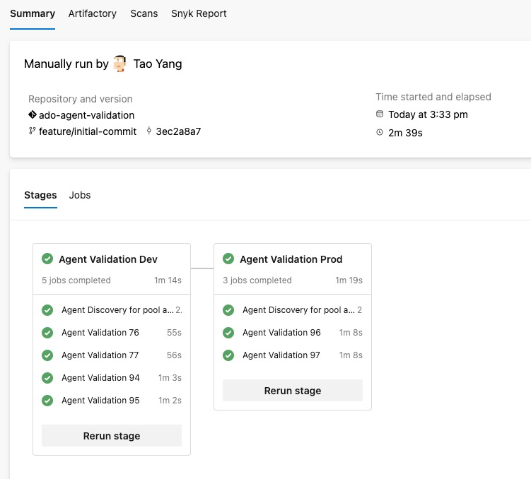
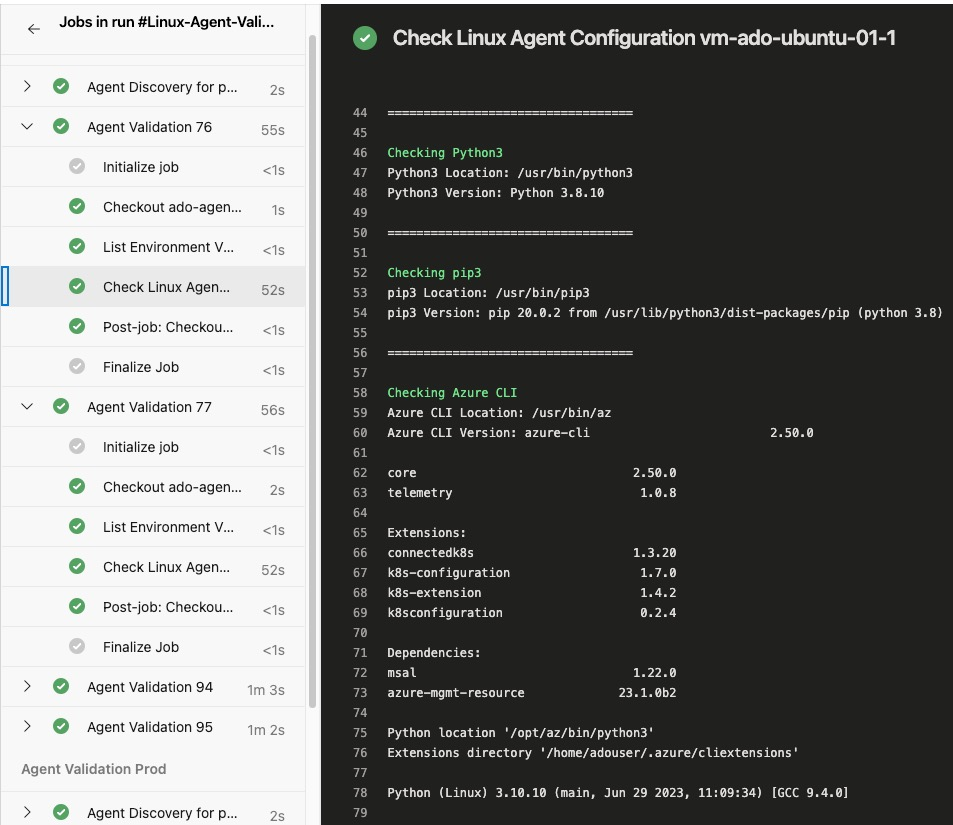
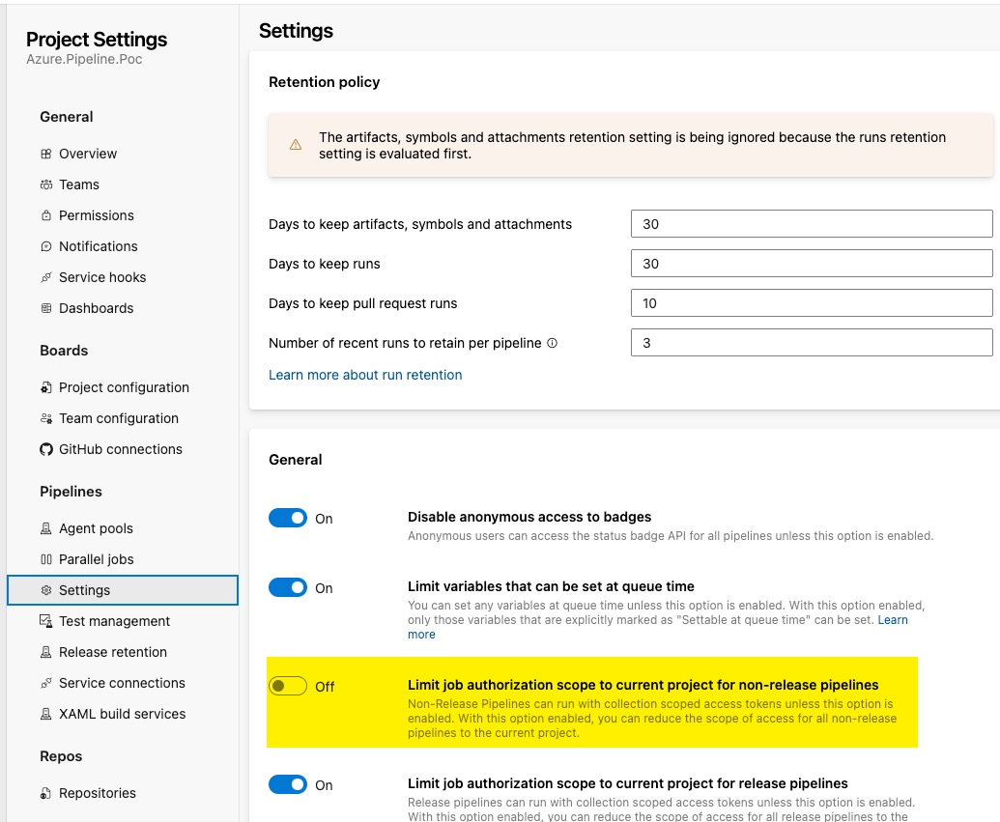
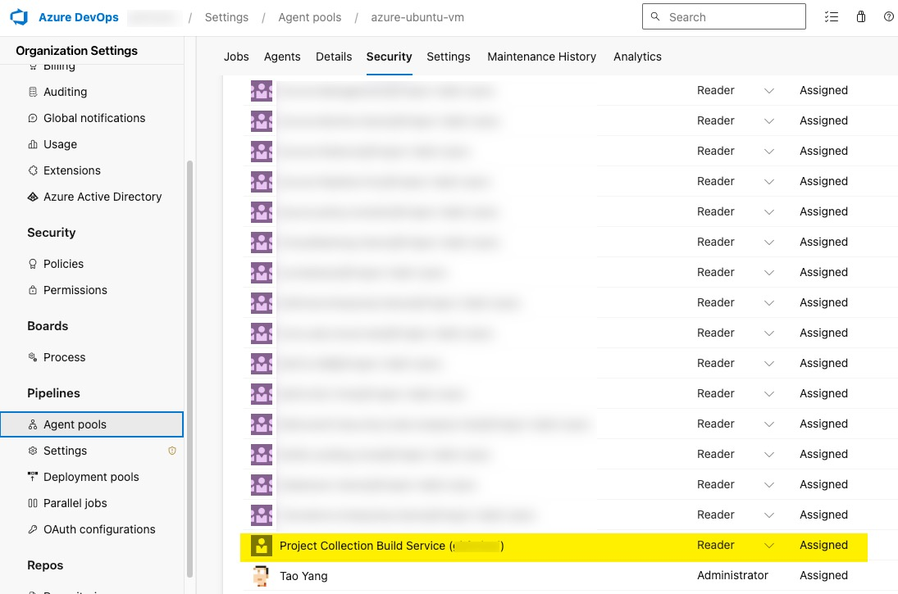
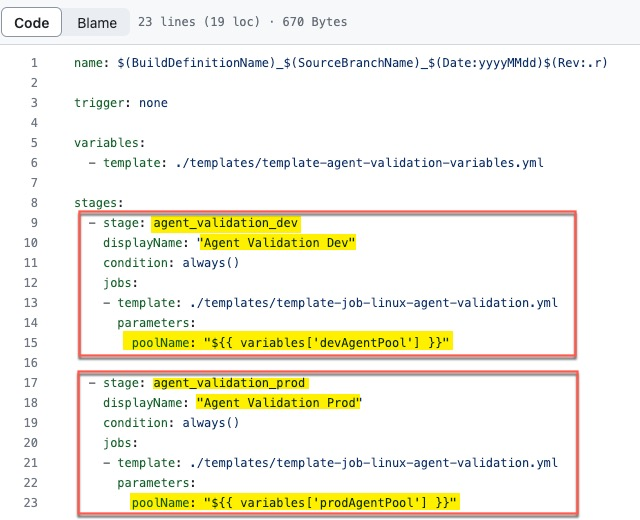
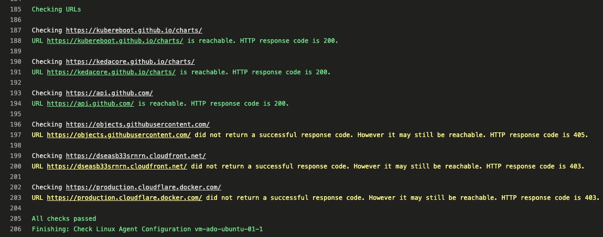

## Introduction

Being an DevOps consultant for Azure, most of the large enterprise customers I have worked with are using Azure DevOps (either the cloud version or the on-premises ADO servers).

For every project that I'm part of, the Self-Hosted agents have **always** been a pre-requisites that we request customers to provision before the start of our engagements. The project team would provide customers the requirements for the agents, such as Operating System type and version, list of required software, list of URLs need to be whitelisted on their Firewalls, etc.. Then in the ideal world the customers would provision the agents for us and we can start working from day 1.

However not even once I have seen these agents being ready for us to consume when we start the project. Last year when I was working on a project, the customer was only able to provide us with the agents in Sprint 8.

When the customers provisioned the agents, it is also very rare that all our requirements are met. It is difficult for us to validate because we would **never** have the access to logon to these agent computers.

At the beginning of every project, it is such a painful experience to get customers to correctly setup ADO agents in a timely manner. Although I cannot help with the provisioning process since every customer's environment is different, but I have spent some time over the last few days to put together a little utility that can be used to validate the self-hosted agents according to our project requirements. I should be able to take this to every project as long as Azure DevOps is the tool of their choice.

This utility is an Azure DevOps Pipeline that can be used to validate the self-hosted Linux agents. It uses bash shell scripts to firstly query Azure DevOps REST API to get a list of agents, then it executes the validation shell script on every single agent in the agent pool.

You can find the code in my GitHub repo **[ado-agent-validation](https://github.com/tyconsulting/ado-agent-validation)**

As shown below, I have 2 agent pools in my lab ADO organisation, both have few Ubuntu VMs provisioned as agents. I have configured 2 agent instances per VM. In total, I have 2 VMs running total of 4 agents in the "dev" agent pool, and 1 VM running 2 agents in the "prod" agent pool.

The agent validation jobs are executed in parallel within each stage. It ensures all agents must be validated before completing the stage. If an agent is offline for some reason, the pipeline will wait for the agent to come back online and run the tasks.

In the agent validation script used by the pipeline ([linux-agent-check.sh](https://github.com/tyconsulting/ado-agent-validation/blob/main/scripts/linux-agent-check.sh)), I have included the following checks:

* Check if the following software are installed:
  * `python3` and `pip3`
  * `Azure CLI`
    * CLI Extensions: `bicep`, `k8s-configuration`, `k8sconfiguration`, `connectedk8s`, `k8s-extension`
  * `podman`
  * `kubectl` and `kubelogin`
  * Azure `Bicep` (Standalone) version
  * `PowerShell Core`
    * PowerShell modules: `az`, `az.resourceGraph`, `Microsoft.Graph`, `Pester`, `PSRule`, `PSRule.Rules.Azure`, `powershell-yaml`
  * `jq`

* Check if the following URLs are reachable:
  * `https://kubereboot.github.io/charts/`
  * `https://kedacore.github.io/charts/`
  * `https://api.github.com/`
  * `https://objects.githubusercontent.com/`
  * `https://dseasb33srnrn.cloudfront.net/`
  * `https://production.cloudflare.docker.com/`

## Setup

### Prerequisites

You must allow the pipeline to read the agent pool information from your Azure DevOps organisation (or project collection if you are using ADO servers). You need to complete the following steps:

1. In your Azure DevOps project where the pipeline is located, make sure the setting `Limit job authorization scope to current project for non-release pipelines` is **turned off**:

2. For each agent pool you want to validate, you need to grant the `Project Collection Build Service (your organisation name)` account the `Reader` role. This is done in the **Organization Settings** --> **Agent pools** --> Select the pool--> Under the **Security** tab of the agent pool, grant the reader role to the account.

## Prepare the code

When you are preparing the pipeline code in a git repository, you need to make sure all agent pool names are defined in the variable yaml template [template-agent-validation-variables.yml](https://github.com/tyconsulting/ado-agent-validation/blob/main/pipelines/templates/template-agent-validation-variables.yml)

Secondly, configure the pipeline YAML file [azure-pipelines-linux-ado-agent-validation.yaml](https://github.com/tyconsulting/ado-agent-validation/blob/main/pipelines/azure-pipelines-linux-ado-agent-validation.yaml) to have a stage for each agent pool you want to validate. The `poolName` value is from the variable defined in the previous step. For example, in my sample code, I have 2 agent pools (dev and prod), so I have 2 stages in the pipeline YAML file:

Lastly, update the agent validation script [linux-agent-check.sh](https://github.com/tyconsulting/ado-agent-validation/blob/main/scripts/linux-agent-check.sh) according to your requirements. You can add or remove checks as you wish. I have tested this script on both Ubuntu and RHEL agents.

When you are ready, create a new pipeline from the existing YAML file **pipelines/azure-pipelines-linux-ado-agent-validation.yaml** and you can start validating your agents!

## Limitations

1. If a computer is hosting multiple agents, the validation script will run multiple times on this computer because it runs on every agent. I haven't found a way to solve this problem and let the pipeline to only run once per agent computer. This is because the [List Agent REST API for Azure DevOps](https://learn.microsoft.com/en-us/rest/api/azure/devops/distributedtask/agents/list?view=azure-devops-rest-7.0) does not return the agent computer name. Therefore I cannot configure the pipeline stage matrix to loop based on computer names.

2. This pipeline **ONLY** works for Linux agents. I have no requirements for Windows agents hence I've never bothered to create a windows version of this pipeline.

3. During the URL tests, the script determines the result based on the [HTTP response status code](https://en.wikipedia.org/wiki/List_of_HTTP_status_codes). Any code in 2xx and 4xx ranges are considered passed (although 4xx codes indicate client errors.) Some of the URLs I'm testing will return 403 (Forbidden), 404 (Not Found), 405 (Method Not allowed) codes, but I still consider them as passed. This is because These URLs we have requested customers to whitelist would be for a site, not specific pages. If the site is accessible, I consider the test passed. A different message in yellow colour will be displayed for any URLs that return 4xx codes.

